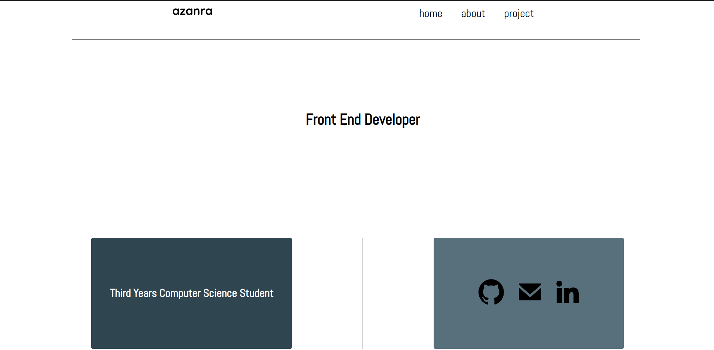

# personal-portfolio

## Links
- [live preview]()

# About
This project contain basic personal information, personal project,
and curriculum vitae. The project focus on using the web font, using
relative unit for font and element to make the layout relative to the
viewport sizes, using css normalizer to change the behavior of user
agent stylesheet, and convert figma design to svg to be used in html.

# Review
- Decide the unit to be used for css and ensure it consistently entire project.
- Reduce the redundant css declaration.
- Find a way to reuse an html element and css, not writing it from 
scratch everytime you need it. eg header and footer element should
be consistent across the project. 
- Organize the project.

# Screenshot
